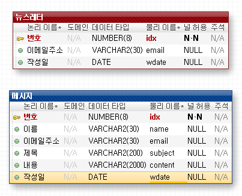

# Portfolio

--------------
## 1. 목차
```
.포트폴리오 사이트
├── 1.목차
├── 2.URL
├── 3.개요
├── 4.특징
├── 5.사용법
|   ├── 5.1.개발 환경 & 개발 툴
|   └── 5.2.실행 방법
|       ├── 5.2.1 실행 환경 세팅
|       └── 5.2.2 실행
└── 6.스크린샷
    ├── 6.1.메인 화면
    ├── 6.2.About 화면
    ├── 6.3.프로젝트 리스트 화면
    ├── 6.4.Contact 화면
    ├── 6.5.관리자 페이지 화면
    └── 6.6.데이터베이스 테이블 화면
```

## 2. URL 
# http://0254.duckdns.org:9090/portfolio/


## 3. 개요
 - **Spring Framework**로 구현한 **MVC패턴의 포털 사이트**입니다. 
 - Maven, MyBatis, Log4j, Lombok, 구글 API 등 다양한 라이브러리 및 유틸리티를 활용하였습니다. 
 - 기존 포트폴리오에서 디자인적 요소를 추가하였고 모바일이나 태블릿 PC모두 잘보이도록 수정했습니다.
 
 
 
## 4. 특징
 - 반응형 웹페이지로 PC와 MOBILE등 각 기기에 맞도록 최적화된 화면을 보여줍니다.
 - HTML5 동영상 배경화면을 적용하였습니다.
 - 프로젝트 리스트와 상세정보를 볼 수 있도록 하였습니다.
 - 해당 프로젝트를 클릭하면 자세한 설명과 함께 여러 사진을 볼 수 있는 사진첩을 만들어 확대하여 볼 수 있습니다.
 - Contact부분에는 구글 지도를 사용하는 api를 사용했으며 메시지를 보낼 수 있습니다.
 - 데이터베이스는 메시지 테이블, 뉴스레터 테이블로 총 2개의 테이블로 구성되어 있습니다.
 - 관리자는 관리자 페이지에서 메시지 목록과 뉴스레터 목록 확인 및 관리가 가능합니다.
 - aws로 구동하며 http://0254.duckdns.org:9090/portfolio 주소를 입력하면 접속이 가능합니다.


## 5. 사용법
### 5.1. 개발 환경 & 개발 툴
- Programing Language : HTML, CSS, JavaScript, jQuery, Java 8, JSP, Servlet
- Framework : Bootstrap, Spring 5.1.4, MyBatis
- Database : Oracle Database 11g Express
- API : Google Maps JavaScript API
- Server : Apache Tomcat 8.5
- OS: Windows 10 
-----------------------------------------------------------------------------
- Tool : Spring Tool Suite, VS code
- DB Modeling Tool : Exerd
- Graphic Tool : Adobe Photoshop CC


### 5.2. 실행 방법
#### 5.2.1 실행환경 세팅
```
# 1. Spring Tool Suite에 해당 프로젝트를 import 합니다.
- ojdbc6.jar 파일이 lib 폴더에 포함되어 있습니다. 
# 2. src/main/resources/DDL 폴더에 있는 portfolio.sql로 테이블을 만드시기 바랍니다. 
- 총 2개의 테이블이 있습니다.
# 3. JNDI설정을 확인하여 DB Connection 여부를 확인하시기 바랍니다.
- jndiDataSource를 참조하지 않으신다면 dataSource bean을 해당 컴퓨터의 설정에 맞게 수정하여 sqlSessionFactoryBean의 property를 jndiDataSource에서 dataSource로 수정하시기 바랍니다.
# 4. 이렇게 하면 세팅은 완료됩니다.
```
#### 5.2.2 실행
```
# 1. 설정이 완료되면 server를 시작하고, 웹 사이트 주소 창에 http://localhost:8080/portfolio를 입력하시면 됩니다. 
- 포트 번호(8080)는 본인의 컴퓨터에 설정된 톰캣의 포트번호로 변경해주시기 바랍니다. 
# 2. 관리자는 관리자 페이지에서 등록된 메시지와 뉴스레터 목록를 관리 할 수 있습니다.
```


## 6. 스크린샷

### 6.1.메인 화면
 
 -------------

### 6.2. About 화면
 
 -------------
 
 ### 6.3. 프로젝트 리스트 화면
 
 -------------
  
 ### 6.4. Contact 화면
 
 -------------
  
 ### 6.5. 관리자 페이지 화면
 
 -------------
  
 ### 6.6. 데이터베이스 테이블 화면
 
 -------------

------------------------------------------------------------------------------
# 감사합니다!
